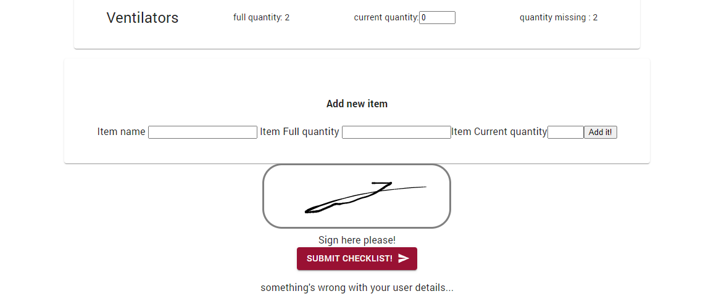

# Supply Check

## Background

this is an app built as an exercise to practice the usage of state management with Redux Toolkit and React. Material UI is also used here.  
The app includes a checklist for filling out the actual ammount of medical equipment found in a certain medical station.

## Usage

Simply fill in the found ammount of equipment per item.
If there's an item that wasn't found in the base list, it can be added through the 'Add New Item' section.

Make sure you sign the document before sending it!

